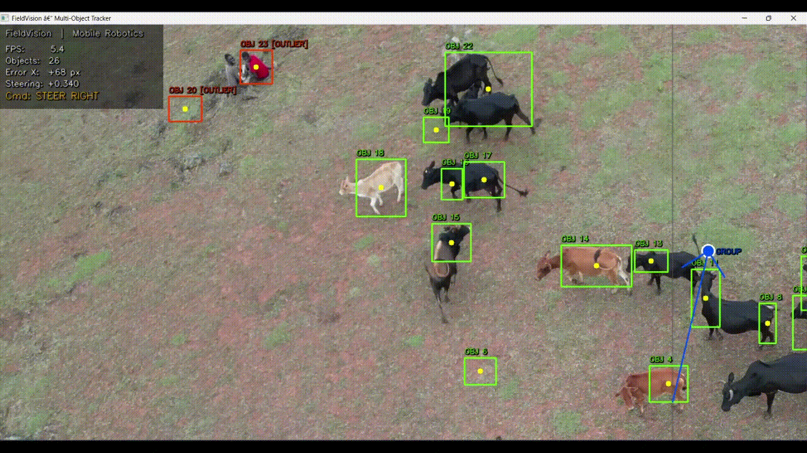

# FieldVision: OpenCV Group Motion Tracking for Field Robotics

FieldVision is a lightweight OpenCV demo that detects moving objects in video, estimates the group center, flags separated/outlier objects, and turns the visual state into a simple steering signal.

```text
camera input → motion detection → object localization → group estimation → control signal
```

## Demo



## Features

- Motion detection using OpenCV background subtraction
- Contour-based object localization
- Bounding boxes and object center points
- Group centroid estimation
- Outlier detection for separated objects
- Simple proportional steering signal
- FPS and foreground-mask debug overlay
- Supports webcam input or video files

## Why I Built This

I built this to practice the robotics perception-to-control loop: taking raw camera input, extracting useful state, and producing a basic control decision from it.

## How It Works

FieldVision uses OpenCV’s MOG2 background subtractor to isolate moving foreground objects. It cleans the mask with erosion and dilation, finds contours, filters them by area, and draws bounding boxes around valid moving objects.

The center of each object is used to estimate a group centroid. If an object is far from the group center, it is flagged as an outlier.

The group centroid is compared to the center of the frame:

```text
error_x = group_center_x - frame_center_x
steering_signal = Kp * error_x
```

This creates a simple steering command:

- `STEER LEFT`
- `STEER RIGHT`
- `CENTERED / TRACK`
- `SEARCHING`

## Installation

```bash
pip install -r requirements.txt
```

## Usage

Run with the default source:

```bash
python main.py
```

Run with a video file:

```bash
python main.py path/to/video.mp4
```

Press `q` to quit.

## Requirements

```txt
opencv-python
numpy
```

## Limitations

This is a prototype, not a production vision system.

- Works best with a mostly stationary camera
- Detects motion, not object class
- Does not use a trained detection or segmentation model
- Does not maintain persistent object IDs across frames
- Can be affected by shadows, lighting changes, camera shake, or merged objects

## Future Improvements

- Add persistent object tracking IDs
- Use a trained detector or segmentation model
- Export object positions and steering values to CSV
- Publish detections/control signals through ROS2
- Test on edge hardware such as a Raspberry Pi or NVIDIA Jetson

## Tech Stack

- Python
- OpenCV
- NumPy